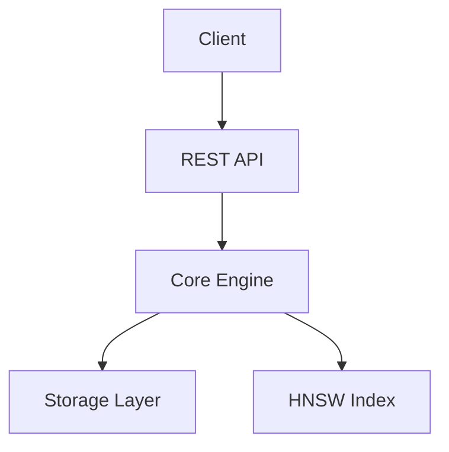
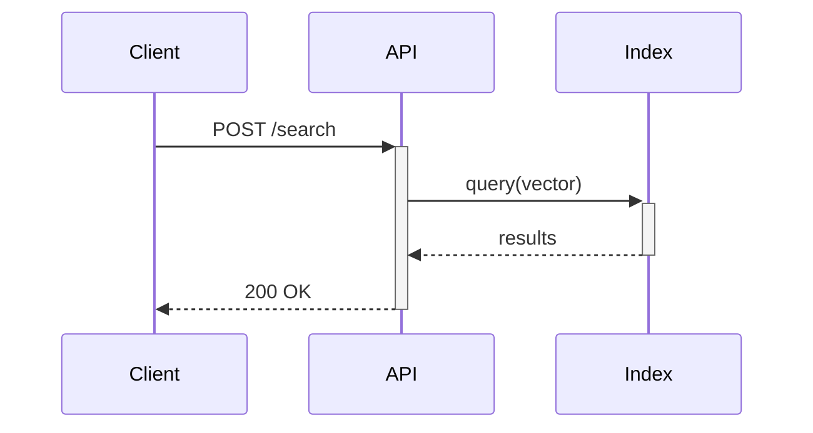
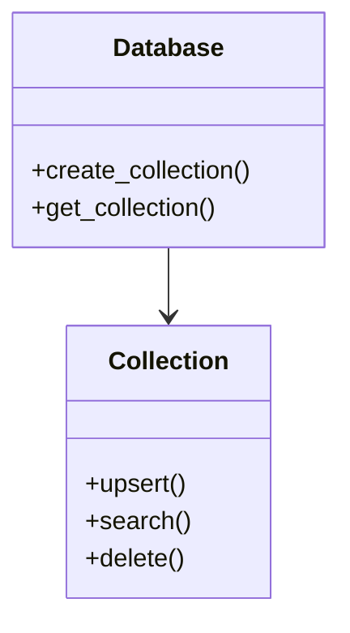

# Workflow : Documentation Complète (Marketing / Fonctionnel / Technique)

Ce workflow guide la mise à jour professionnelle de toute la documentation du projet.

---

## 0. Préparation - Analyse de l'existant

1. Scanner la structure documentaire actuelle :
// turbo
```powershell
Get-ChildItem -Path . -Include *.md,*.rst,*.txt -Recurse | Select-Object FullName, Length | Format-Table -AutoSize
```

2. Identifier les fichiers à mettre à jour :
   - `README.md` - Vitrine principale (Marketing + Quick Start)
   - `docs/` - Documentation détaillée
   - `CHANGELOG.md` - Historique des versions
   - `CONTRIBUTING.md` - Guide contributeurs
   - `api-reference.md` - Référence API

3. Lister les features récemment implémentées :
// turbo
```powershell
git log --oneline -20 --grep="feat"
```

---

## 1. Documentation Marketing (README.md)

### 1.1 Structure recommandée

```markdown
# Project Name

> Tagline percutante (max 10 mots)

[][...]
[][...]
[][...]

## Why [Project]?

3-4 bullet points de valeur unique (USP)

## Quick Start

Code minimal fonctionnel en <10 lignes

## Features

Liste des features avec emojis

## Benchmarks (si applicable)

Tableau comparatif vs concurrents

## Installation

Instructions multi-plateforme

## Documentation

Liens vers docs détaillées

## Roadmap

Vision future (attire contributeurs)

## License
```

### 1.2 Checklist Marketing

- [ ] Tagline claire et mémorable
- [ ] Badges à jour (CI, version, license, downloads)
- [ ] Screenshot/GIF de démo si UI
- [ ] Benchmarks vs concurrents (si applicable)
- [ ] Liens sociaux (Discord, Twitter, etc.)
- [ ] Call-to-action clair (Star, Install, Contribute)

### 1.3 SEO/Discoverability

- [ ] Keywords dans le titre et description
- [ ] Topics GitHub configurés
- [ ] Description GitHub < 350 chars
- [ ] Social preview image configurée

---

## 2. Documentation Fonctionnelle

### 2.1 Structure docs/

```
docs/
├── getting-started/
│   ├── installation.md
│   ├── quickstart.md
│   └── configuration.md
├── guides/
│   ├── basic-usage.md
│   ├── advanced-features.md
│   └── best-practices.md
├── concepts/
│   ├── architecture.md
│   └── glossary.md
├── tutorials/
│   └── [use-case-specific].md
└── faq.md
```

### 2.2 Template Guide Fonctionnel

```markdown
# [Feature Name]

## Overview

Explication en 2-3 phrases.

## Prerequisites

- Requirement 1
- Requirement 2

## Step-by-Step

### Step 1: [Action]

Description + code example

### Step 2: [Action]

...

## Configuration Options

| Option | Type | Default | Description |
|--------|------|---------|-------------|
| ... | ... | ... | ... |

## Common Issues

### Issue 1

Problem + Solution

## See Also

- [Related Guide 1](link)
- [Related Guide 2](link)
```

### 2.3 Checklist Fonctionnelle

- [ ] Tous les use cases principaux documentés
- [ ] Exemples de code testés et fonctionnels
- [ ] Screenshots/diagrams si UI complexe
- [ ] FAQ mise à jour
- [ ] Liens croisés entre guides

---

## 3. Documentation Technique

### 3.1 Structure technique

```
docs/
├── development/
│   ├── ARCHITECTURE.md
│   ├── CODING_RULES.md
│   ├── PROJECT_STRUCTURE.md
│   └── TESTING.md
├── api/
│   ├── api-reference.md
│   └── openapi.yaml (si REST)
└── deployment/
    ├── docker.md
    └── kubernetes.md
```

### 3.2 Template Architecture

```markdown
# Architecture

## High-Level Overview

[Diagramme ASCII ou Mermaid]

## Components

### Component 1

- **Responsabilité**: ...
- **Fichiers**: `src/component1/`
- **Dépendances**: Component2, Component3

### Component 2

...

## Data Flow

1. User request arrives at...
2. ...

## Design Decisions

### Decision 1: [Choix technique]

- **Context**: Problème à résoudre
- **Decision**: Solution choisie
- **Consequences**: Trade-offs acceptés

## Performance Considerations

...

## Security Model

...
```

### 3.3 API Reference Template

```markdown
# API Reference

## Overview

Base URL: `http://localhost:8080/api/v1`

## Authentication

...

## Endpoints

### `POST /collections`

Create a new collection.

**Request Body**:
```json
{
  "name": "string",
  "dimension": 128
}
```

**Response** (201):
```json
{
  "id": "uuid",
  "name": "string"
}
```

**Errors**:
| Code | Description |
|------|-------------|
| 400 | Invalid dimension |
| 409 | Collection exists |
```

### 3.4 Checklist Technique

- [ ] Architecture documentée avec diagrammes
- [ ] Tous les endpoints API documentés
- [ ] Exemples de requêtes/réponses
- [ ] Codes d'erreur listés
- [ ] Instructions de build/test
- [ ] Variables d'environnement documentées

---

## 4. Génération automatique

### 4.1 Rust Doc

// turbo
```powershell
cargo doc --no-deps --open
```

### 4.2 Vérifier les liens cassés

```powershell
# Installer markdown-link-check si nécessaire
npx markdown-link-check README.md
```

### 4.3 Générer table des matières

```powershell
# Pour les longs documents
npx markdown-toc -i docs/guide.md
```

---

## 5. Review & Validation

### 5.1 Checklist finale

**Marketing**:
- [ ] README attrayant et professionnel
- [ ] Badges fonctionnels
- [ ] Quick start testé

**Fonctionnel**:
- [ ] Tous les exemples de code fonctionnent
- [ ] Pas de jargon non expliqué
- [ ] Navigation claire

**Technique**:
- [ ] Architecture à jour
- [ ] API reference complète
- [ ] Instructions reproductibles

### 5.2 Commit documentation

```powershell
git add docs/ README.md CHANGELOG.md
git commit -m "docs: update documentation for vX.Y.Z"
```

---

## 6. Templates Mermaid utiles

### Architecture diagram


### Sequence diagram


### Class diagram


---

## 7. Ressources

- [Google Developer Documentation Style Guide](https://developers.google.com/style)
- [Write the Docs](https://www.writethedocs.org/guide/)
- [Diátaxis Framework](https://diataxis.fr/) - Tutorials, How-to, Reference, Explanation
