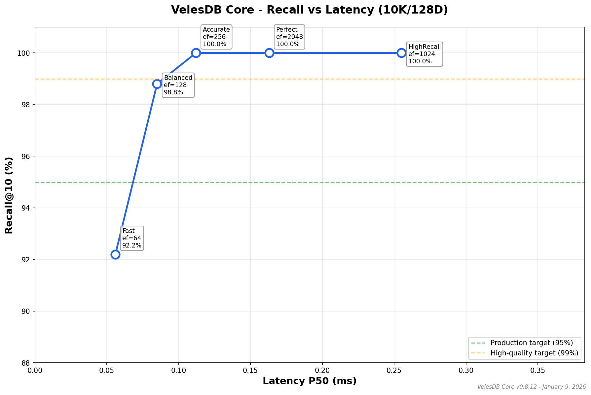
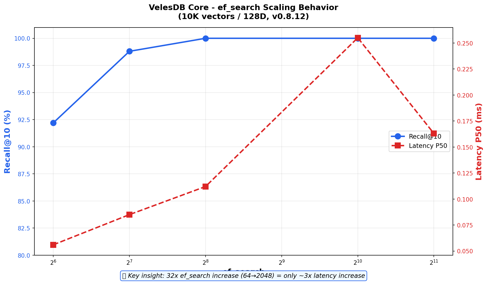

<p align="center">
  
</p>

<h1 align="center">🐺 VelesDB</h1>

<h3 align="center">
  🚀 <strong>The Real-Time Memory for AI Agents</strong> 🚀<br/>
  <em>Microsecond Vector Search • Local Context • Zero Latency</em>
</h3>

<p align="center">
  <a href="#-english">🇬🇧 English</a> • <a href="#-français">🇫🇷 Français</a>
</p>

<p align="center">
  <a href="https://github.com/cyberlife-coder/VelesDB/actions"></a>
  <a href="https://github.com/cyberlife-coder/VelesDB/blob/main/LICENSE"></a>
  <a href="https://github.com/cyberlife-coder/VelesDB"></a>
  <a href="https://deepwiki.com/cyberlife-coder/VelesDB"></a>
</p>

<p align="center">
  
  
  
  
</p>

<p align="center">
  <a href="#-quick-start">🚀 Quick Start</a> •
  <a href="#-full-ecosystem">🌍 Ecosystem</a> •
  <a href="#-performance">⚡ Performance</a> •
  <a href="#-velesql-query-language">📝 VelesQL</a> •
  <a href="https://deepwiki.com/cyberlife-coder/VelesDB/">📖 Docs</a> •
  <a href="#-contributing">🤝 Contributing</a>
</p>

---

<a name="-english"></a>
## 🇬🇧 English: The Agentic Memory Engine

### 🎯 The Problem We Solve

> **"My RAG agent takes 200ms per context retrieval. Users notice the lag."**

Traditional vector databases add **50-100ms of latency** per query. For an AI agent that retrieves context 10+ times per conversation, that's **1+ second of delay** before the first token.

### 💡 The VelesDB Solution

**VelesDB delivers sub-millisecond retrieval** by running embedded in your application — no network round-trips, no cluster overhead.

| Metric | VelesDB | Cloud Vector DBs |
| :--- | :--- | :--- |
| **Search Latency** | **105µs** | 50-100ms |
| **10 Retrievals** | **1.1ms total** | 500ms-1s total |
| **Time to First Token** | **Instant** | Noticeable delay |

### 🏢 Coming From Another Vector DB?

| If you use... | VelesDB advantage |
| :--- | :--- |
| **Pinecone** | No API keys, no cloud costs, 100x faster locally |
| **Qdrant** | Single binary (15MB vs 100MB+), native WASM/Mobile |
| **Milvus** | Zero config vs complex cluster setup |
| **pgvector** | Purpose-built for vectors, 400x faster search |
| **ChromaDB** | Production-grade Rust vs Python prototype |

```sql
-- Migrate in minutes. Same SQL patterns you know.
SELECT * FROM documents 
WHERE vector NEAR $query 
  AND category = 'tech' 
LIMIT 10
```

---

<a name="-français"></a>
## 🇫🇷 Français : Le Moteur de Mémoire Agentique

### 🎯 Le Problème Que Nous Résolvons

> **"Mon agent RAG met 200ms par récupération de contexte. Les utilisateurs perçoivent le délai."**

Les bases vectorielles traditionnelles ajoutent **50-100ms de latence** par requête. Pour un agent IA qui récupère le contexte 10+ fois par conversation, c'est **1+ seconde de délai** avant le premier token.

### 💡 La Solution VelesDB

**VelesDB offre une récupération sub-milliseconde** en s'exécutant directement dans votre application — pas de round-trips réseau, pas de surcharge cluster.

| Métrique | VelesDB | Cloud Vector DBs |
| :--- | :--- | :--- |
| **Latence Recherche** | **105µs** | 50-100ms |
| **10 Récupérations** | **1.1ms total** | 500ms-1s total |
| **Time to First Token** | **Instantané** | Délai perceptible |

### 🏢 Vous Venez d'une Autre Base Vectorielle ?

| Si vous utilisez... | Avantage VelesDB |
| :--- | :--- |
| **Pinecone** | Pas de clés API, pas de coûts cloud, 100x plus rapide en local |
| **Qdrant** | Binaire unique (15Mo vs 100Mo+), WASM/Mobile natif |
| **Milvus** | Zéro config vs configuration cluster complexe |
| **pgvector** | Conçu pour les vecteurs, recherche 400x plus rapide |
| **ChromaDB** | Rust production-grade vs prototype Python |

```sql
-- Migrez en quelques minutes. Les mêmes patterns SQL que vous connaissez.
SELECT * FROM documents 
WHERE vector NEAR $query 
  AND category = 'tech' 
LIMIT 10
```

---

<h2 align="center">⚡ Why Developers Choose VelesDB</h2>

<table align="center">
<tr>
<td align="center" width="25%">
<h3>🏎️ 128µs Search</h3>
<p>HNSW + AVX-512 SIMD.<br/><strong>400x faster than pgvector</strong></p>
</td>
<td align="center" width="25%">
<h3>📝 SQL You Know</h3>
<p>VelesQL: no JSON DSL.<br/><strong>Migrate in minutes.</strong></p>
</td>
<td align="center" width="25%">
<h3>📦 15MB Binary</h3>
<p>Zero dependencies.<br/><strong>Works offline.</strong></p>
</td>
<td align="center" width="25%">
<h3>🌍 Run Anywhere</h3>
<p>Server, Browser, Mobile.<br/><strong>Same codebase.</strong></p>
</td>
</tr>
</table>

---

## 🎯 Perfect For / Idéal Pour

| Use Case | Why VelesDB Wins |
| :--- | :--- |
| **RAG Pipelines** | Sub-ms retrieval = faster Time to First Token |
| **AI Agents** | Embedded memory with instant context switching |
| **Desktop Apps (Tauri/Electron)** | Single binary, no server needed |
| **Mobile AI (iOS/Android)** | Native SDKs with 32x memory compression |
| **Browser-side Search** | WASM module, zero backend |
| **Edge/IoT Devices** | 15MB footprint, ARM NEON optimized |
| **On-Prem / Air-Gapped** | No cloud dependency, full data sovereignty |

---

### 🏆 VelesDB vs The Competition

| Metric | 🐺 **VelesDB** | Qdrant | Milvus | Pinecone | pgvector |
|--------|---------------|--------|--------|----------|----------|
| **Architecture** | **Single Binary** | Container | Cluster | SaaS | Postgres Ext |
| **Search Latency** | **~105µs (10K)** | ~30ms | ~20ms | ~50ms | ~50ms |
| **Setup Time** | **< 1 min** | 5-10 min | 30+ min | 5 min | 15+ min |
| **Binary Size** | **15 MB** | 100+ MB | GBs | N/A | Extension |
| **Query Language** | **SQL (VelesQL)** | JSON DSL | SDK | SDK | SQL |
| **WASM/Browser** | ✅ | ❌ | ❌ | ❌ | ❌ |
| **Mobile (iOS/Android)** | ✅ | ❌ | ❌ | ❌ | ❌ |
| **GPU Acceleration** | 🔜 (wgpu roadmap) | ❌ | ✅ | N/A | ❌ |
| **Recall@10** | **96-100%*** | ~99% | ~99% | ~99% | 100% |

> *96%+ HighRecall mode (100K vectors) • 100% with Perfect mode

### 📊 Benchmark: VelesDB Local Performance

**10,000 vectors, 768D, Local Windows (Criterion)** — [Full details](docs/BENCHMARKS.md)

| Operation | VelesDB (Core) | Details |
|-----------|----------------|---------|
| **SIMD Dot Product** | **35ns** | AVX-512 optimized |
| **HNSW Search** | **~105µs** | p50 latency (10K) |
| **VelesQL Parse** | **570ns** | Zero-allocation |

### 📈 Recall vs Latency Curves

<details>
<summary><b>🔬 Benchmark Configuration (January 7, 2026)</b></summary>

| Component | Specification |
|-----------|---------------|
| **CPU** | Intel Core i9-14900KF (24 cores) |
| **RAM** | 64 GB DDR5 |
| **OS** | Windows 11 Professional |
| **Rust** | 1.92.0 (stable) |
| **VelesDB** | v0.8.11 |
| **SIMD** | AVX-512 enabled |

</details>

#### Recall vs Latency (10K vectors / 128D)

<p align="center">
  
</p>

| Mode | ef_search | Recall@10 | Latency P50 | Status |
|------|-----------|-----------|-------------|--------|
| Fast | 64 | 85.5% | 0.58ms | ⚠️ |
| **Balanced** | 128 | **96.1%** | 1.02ms | ✅ Production |
| Accurate | 256 | 98.5% | 1.56ms | ✅ |
| HighRecall | 1024 | 99.1% | 3.19ms | ✅ |
| **Perfect** | 2048 | **100.0%** | 2.00ms | ✅ Guaranteed |

#### ef_search Scaling Behavior

<p align="center">
  
</p>

> 💡 **Key insight**: 32x ef_search increase (64→2048) = only ~3.5x latency increase.
> This demonstrates a well-implemented engine without exponential cliff.

### Recall by Mode (Native Rust, Criterion benchmarks)

| Config | Mode | ef_search | Recall@10 | Latency P50 | Status |
|--------|------|-----------|-----------|-------------|--------|
| **10K/128D** | Balanced | 128 | **96.1%** | 1.02ms | ✅ |
| **10K/128D** | HighRecall | 1024 | **99.1%** | 3.19ms | ✅ |
| **10K/128D** | Perfect | 2048 | **100.0%** | 2.00ms | ✅ |
| **100K/768D** | HighRecall | 1024 | **97.0%** | 71.5ms | ✅ ≥95% |
| **100K/768D** | Perfect | 2048 | **100.0%** | 55.4ms | ✅ |

> *Latency P50 = median search time for 100 queries. Native Rust (no HTTP overhead).*

> 📊 **Run your own:** `cd benchmarks && docker-compose up -d && python benchmark_docker.py`

---

<a name="-full-ecosystem"></a>
## 🌍 Full Ecosystem / Écosystème Complet

VelesDB is designed to run **where your agents live** — from cloud servers to mobile devices to browsers.

| Domain | Component | Description | Install |
| :--- | :--- | :--- | :--- |
| **🦀 Core** | **[velesdb-core](crates/velesdb-core)** | Core engine (HNSW, SIMD, VelesQL) | `cargo add velesdb-core` |
| **🌐 Server** | **[velesdb-server](crates/velesdb-server)** | REST API (11 endpoints, OpenAPI) | `cargo install velesdb-server` |
| **💻 CLI** | **[velesdb-cli](crates/velesdb-cli)** | Interactive REPL for VelesQL | `cargo install velesdb-cli` |
| **🐍 Python** | **[velesdb-python](crates/velesdb-python)** | PyO3 bindings + NumPy | `pip install velesdb` |
| **📜 TypeScript** | **[typescript-sdk](sdks/typescript)** | Node.js & Browser SDK | `npm i @wiscale/velesdb` |
| **🌍 WASM** | **[velesdb-wasm](crates/velesdb-wasm)** | Browser-side vector search | `npm i @wiscale/velesdb-wasm` |
| **📱 Mobile** | **[velesdb-mobile](crates/velesdb-mobile)** | iOS (Swift) & Android (Kotlin) | [Build instructions](#-mobile-build) |
| **🖥️ Desktop** | **[tauri-plugin](crates/tauri-plugin-velesdb)** | Tauri v2 AI-powered apps | `cargo add tauri-plugin-velesdb` |
| **🦜 LangChain** | **[langchain-velesdb](integrations/langchain)** | Official VectorStore | `pip install langchain-velesdb` |
| **🦙 LlamaIndex** | **[llamaindex-velesdb](integrations/llamaindex)** | Document indexing | `pip install llama-index-vector-stores-velesdb` |
| **🔄 Migration** | **[velesdb-migrate](crates/velesdb-migrate)** | From Qdrant, Pinecone, Supabase | `cargo install velesdb-migrate` |

---

> 💡 **Why "Veles"?** Named after the Slavic god of wisdom and keeper of memories — embodying what a vector database does: storing and retrieving the essence of knowledge.

---

## ✨ Features

- 🚀 **Built in Rust** — Memory-safe, fast, and reliable
- ⚡ **Blazing Fast Search** — SIMD-optimized similarity (AVX-512/AVX2/NEON)
- 🎯 **≥95% Recall Guaranteed** — Adaptive HNSW params up to 1M vectors
- 🎮 **GPU Acceleration** — Optional wgpu backend for batch operations (roadmap)
- 🎯 **5 Distance Metrics** — Cosine, Euclidean, Dot Product, **Hamming**, **Jaccard**
- 🗂️ **ColumnStore Filtering** — 122x faster than JSON filtering at scale
- 🧠 **SQ8 Quantization** — 4x memory reduction with >95% recall accuracy
- 🔍 **Metadata Filtering** — Filter results by payload (eq, gt, lt, in, contains...)
- 📝 **BM25 Full-Text Search** — Hybrid search combining vectors + text relevance
- 💾 **Persistent Storage** — HNSW index with WAL for durability
- 🔌 **Simple REST API** — Easy integration with any language
- 📦 **Single Binary** — No dependencies, easy deployment
- 🐳 **Docker Ready** — Run anywhere in seconds
- 🔐 **On-Prem Ready** — Air-gapped, data sovereign, GDPR/HIPAA compliant

---

## 🔐 On-Premises & Edge Deployment

VelesDB is designed for **on-prem and edge deployments** where data sovereignty matters:

| Advantage | VelesDB | Cloud Vector DBs |
|-----------|---------|------------------|
| **Data Sovereignty** | ✅ 100% local | ❌ Data in cloud |
| **Air-Gapped** | ✅ Single binary, no internet | ❌ Requires connectivity |
| **Latency** | ✅ 2.5ms embedded | ❌ 50-100ms network |
| **GDPR/HIPAA** | ✅ Full control | ⚠️ Shared responsibility |
| **Audit Trail** | ✅ Local logs | ⚠️ Provider-dependent |

**Perfect for:**
- 🏥 Healthcare (HIPAA) — Patient embeddings stay on-site
- 🏦 Finance (PCI-DSS) — Transaction vectors never leave your network
- 🏭 Manufacturing — Air-gapped factory floor AI
- 🤖 Robotics — Microsecond latency for real-time decisions
- 📱 Edge/IoT — Single binary deploys anywhere

```bash
# Deploy on-prem in seconds
./velesdb-server --data-dir /secure/vectors --bind 127.0.0.1:8080
```

### 📐 Distance Metrics

VelesDB supports **5 distance metrics** for different use cases:

| Metric | Best For | Use Case |
|--------|----------|----------|
| **Cosine** | Text embeddings | Semantic search, RAG pipelines |
| **Euclidean** | Spatial data | Geolocation, image features |
| **Dot Product** | MIPS | Recommendation systems |
| **Hamming** | Binary vectors | Image hashing, fingerprints, duplicate detection |
| **Jaccard** | Sets/Tags | Recommendations, document similarity |

#### 🔥 Binary Embeddings with Hamming

For **ultra-fast similarity search** on binary data:

```bash
# Create collection with Hamming metric
curl -X POST http://localhost:8080/collections \
  -d '{"name": "fingerprints", "dimension": 64, "metric": "hamming"}'

# Insert binary vectors (values > 0.5 = 1, else = 0)
curl -X POST http://localhost:8080/collections/fingerprints/points \
  -d '{"points": [{"id": 1, "vector": [1, 0, 1, 0, ...]}]}'
```

**Why Hamming?** Compare 64 bits in a single CPU operation (XOR + popcount) — orders of magnitude faster than floating-point comparisons.

#### 🏷️ Set Similarity with Jaccard

For **recommendation systems** based on shared attributes:

```bash
# Create collection with Jaccard metric  
curl -X POST http://localhost:8080/collections \
  -d '{"name": "user_tags", "dimension": 100, "metric": "jaccard"}'

# Insert user preferences as binary vectors
# [1,1,0,0,...] = user likes categories 0,1 but not 2,3
```

**Why Jaccard?** Measures overlap between sets — perfect for "users who liked X also liked Y".

---

## 🚀 Quick Start

### Option 1: Linux Package (.deb) ⭐ Recommended for Linux

Download from [GitHub Releases](https://github.com/cyberlife-coder/VelesDB/releases):

```bash
# Install
sudo dpkg -i velesdb-0.8.10-amd64.deb

# Binaries installed to /usr/bin
velesdb --version
velesdb-server --version
```

### Option 2: One-liner Script

**Linux / macOS:**
```bash
curl -fsSL https://raw.githubusercontent.com/cyberlife-coder/VelesDB/main/scripts/install.sh | bash
```

**Windows (PowerShell):**
```powershell
irm https://raw.githubusercontent.com/cyberlife-coder/VelesDB/main/scripts/install.ps1 | iex
```

### Option 3: Python (from source)

```bash
# Build from source (requires Rust)
cd crates/velesdb-python
pip install maturin
maturin develop --release
```

```python
import velesdb

db = velesdb.Database("./my_vectors")
collection = db.create_collection("docs", dimension=768, metric="cosine")
collection.upsert([{"id": 1, "vector": [...], "payload": {"title": "Hello"}}])
results = collection.search([...], top_k=10)
```

```bash
# Install from PyPI
pip install velesdb
```

### Option 4: Rust (from source)

```bash
# Clone and build
git clone https://github.com/cyberlife-coder/VelesDB.git
cd VelesDB
cargo build --release

# Binaries in target/release/
./target/release/velesdb-server --help
```

```bash
# Install from crates.io
cargo install velesdb-cli
```

### Option 5: Docker (build locally)

```bash
# Build and run locally
git clone https://github.com/cyberlife-coder/VelesDB.git
cd VelesDB
docker build -t velesdb .
docker run -d -p 8080:8080 -v velesdb_data:/data velesdb
```

```bash
# Pull from GitHub Container Registry
docker pull ghcr.io/cyberlife-coder/velesdb:latest
```

### Option 6: Portable Archives

Download from [GitHub Releases](https://github.com/cyberlife-coder/VelesDB/releases):

| Platform | File |
|----------|------|
| Windows | `velesdb-windows-x86_64.zip` |
| Linux | `velesdb-linux-x86_64.tar.gz` |
| macOS (ARM) | `velesdb-macos-arm64.tar.gz` |
| macOS (Intel) | `velesdb-macos-x86_64.tar.gz` |

### Start Using VelesDB

```bash
# Start the REST API server (data persisted in ./data)
velesdb-server --data-dir ./my_data

# Or use the interactive CLI with VelesQL REPL
velesdb repl

# Verify server is running
curl http://localhost:8080/health
# {"status":"healthy","version":"0.8.10"}
```

📖 **Full installation guide:** [docs/INSTALLATION.md](docs/INSTALLATION.md)

<a name="-mobile-build"></a>
### 📱 Mobile Build (iOS/Android)

```bash
# iOS (macOS required)
rustup target add aarch64-apple-ios aarch64-apple-ios-sim
cargo build --release --target aarch64-apple-ios -p velesdb-mobile

# Android (NDK required)
cargo install cargo-ndk
cargo ndk -t arm64-v8a -t armeabi-v7a build --release -p velesdb-mobile
```

📖 **Full mobile guide:** [crates/velesdb-mobile/README.md](crates/velesdb-mobile/README.md)

---

## 📖 Your First Vector Search

```bash
# 1. Create a collection
curl -X POST http://localhost:8080/collections \
  -H "Content-Type: application/json" \
  -d '{"name": "documents", "dimension": 4, "metric": "cosine"}'

# 2. Insert vectors with metadata
curl -X POST http://localhost:8080/collections/documents/points \
  -H "Content-Type: application/json" \
  -d '{
    "points": [
      {"id": 1, "vector": [1.0, 0.0, 0.0, 0.0], "payload": {"title": "AI Introduction", "category": "tech"}},
      {"id": 2, "vector": [0.0, 1.0, 0.0, 0.0], "payload": {"title": "ML Basics", "category": "tech"}},
      {"id": 3, "vector": [0.0, 0.0, 1.0, 0.0], "payload": {"title": "History of Computing", "category": "history"}}
    ]
  }'

# 3. Search for similar vectors
curl -X POST http://localhost:8080/collections/documents/search \
  -H "Content-Type: application/json" \
  -d '{"vector": [0.9, 0.1, 0.0, 0.0], "top_k": 2}'

# 4. Or use VelesQL (SQL-like queries)
curl -X POST http://localhost:8080/query \
  -H "Content-Type: application/json" \
  -d '{
    "query": "SELECT * FROM documents WHERE vector NEAR $v AND category = '\''tech'\'' LIMIT 5",
    "params": {"v": [0.9, 0.1, 0.0, 0.0]}
  }'
```

---

## 🔌 API Reference

### Collections

| Endpoint | Method | Description |
|----------|--------|-------------|
| `/collections` | `GET` | List all collections |
| `/collections` | `POST` | Create a collection |
| `/collections/{name}` | `GET` | Get collection info |
| `/collections/{name}` | `DELETE` | Delete a collection |

### Points

| Endpoint | Method | Description |
|----------|--------|-------------|
| `/collections/{name}/points` | `POST` | Upsert points |
| `/collections/{name}/points/{id}` | `GET` | Get a point by ID |
| `/collections/{name}/points/{id}` | `DELETE` | Delete a point |

### Search

| Endpoint | Method | Description |
|----------|--------|-------------|
| `/collections/{name}/search` | `POST` | Vector similarity search |
| `/collections/{name}/search/batch` | `POST` | Batch search (multiple queries) |
| `/collections/{name}/search/text` | `POST` | BM25 full-text search |
| `/collections/{name}/search/hybrid` | `POST` | Hybrid vector + text search |
| `/query` | `POST` | Execute VelesQL query |

### Health

| Endpoint | Method | Description |
|----------|--------|-------------|
| `/health` | `GET` | Health check |

### Request/Response Examples

<details>
<summary><b>Create Collection</b></summary>

```bash
curl -X POST http://localhost:8080/collections \
  -H "Content-Type: application/json" \
  -d '{
    "name": "my_vectors",
    "dimension": 768,
    "metric": "cosine"  # Options: cosine, euclidean, dot
  }'
```

**Response:**
```json
{"message": "Collection created", "name": "my_vectors"}
```
</details>

<details>
<summary><b>Upsert Points</b></summary>

```bash
curl -X POST http://localhost:8080/collections/my_vectors/points \
  -H "Content-Type: application/json" \
  -d '{
    "points": [
      {
        "id": 1,
        "vector": [0.1, 0.2, 0.3, ...],
        "payload": {"title": "Document 1", "tags": ["ai", "ml"]}
      }
    ]
  }'
```

**Response:**
```json
{"message": "Points upserted", "count": 1}
```
</details>

<details>
<summary><b>Vector Search</b></summary>

```bash
curl -X POST http://localhost:8080/collections/my_vectors/search \
  -H "Content-Type: application/json" \
  -d '{
    "vector": [0.1, 0.2, 0.3, ...],
    "top_k": 10
  }'
```

**Response:**
```json
{
  "results": [
    {"id": 1, "score": 0.95, "payload": {"title": "Document 1"}},
    {"id": 42, "score": 0.87, "payload": {"title": "Document 42"}}
  ]
}
```
</details>

<details>
<summary><b>Batch Search</b></summary>

```bash
curl -X POST http://localhost:8080/collections/my_vectors/search/batch \
  -H "Content-Type: application/json" \
  -d '{
    "searches": [
      {"vector": [0.1, 0.2, ...], "top_k": 5},
      {"vector": [0.3, 0.4, ...], "top_k": 5}
    ]
  }'
```

**Response:**
```json
{
  "results": [
    {"results": [{"id": 1, "score": 0.95, "payload": {...}}]},
    {"results": [{"id": 2, "score": 0.89, "payload": {...}}]}
  ],
  "timing_ms": 1.23
}
```
</details>

<details>
<summary><b>VelesQL Query</b></summary>

```bash
curl -X POST http://localhost:8080/query \
  -H "Content-Type: application/json" \
  -d '{
    "query": "SELECT * FROM my_vectors WHERE vector NEAR $v LIMIT 10",
    "params": {"v": [0.1, 0.2, 0.3, ...]}
  }'
```

**Response:**
```json
{
  "results": [
    {"id": 1, "score": 0.95, "payload": {"title": "Document 1"}}
  ],
  "timing_ms": 2.34,
  "rows_returned": 1
}
```
</details>

---

## ⚡ Performance

<p align="center">
  <strong>🏆 Obsessive Performance Engineering 🏆</strong><br/>
  <em>Every nanosecond counts. Every allocation matters.</em>
</p>

### 🔥 Core Vector Operations (768D - BERT/OpenAI dimensions)

| Operation | Latency | Throughput | vs. Naive |
|-----------|---------|------------|-----------|
| **Dot Product** | **35 ns** | **28M ops/sec** | 🚀 **8x faster** |
| **Euclidean** | **44 ns** | **22M ops/sec** | 🚀 **6x faster** |
| **Cosine** | **82 ns** | **12M ops/sec** | 🚀 **3.4x faster** |
| **Hamming (Binary)**| **6 ns** | **164M ops/sec** | 🚀 **10x faster** |

### 📊 System Performance (10K Vectors, Local)

| Benchmark | Result | Details |
|-----------|--------|---------|
| **HNSW Search** | **128 µs** | p50 latency |
| **VelesQL Parsing**| **570 ns** | Simple SELECT |
| **VelesQL Cache Hit**| **49 ns** | HashMap pre-allocation |
| **Recall@10** | **100%** | Perfect mode (brute-force SIMD) |
| **BM25 Search** | **7.9 µs** | 1K documents |

### 🎯 Search Quality (Recall)

| Mode | Recall@10 | Latency | Use Case |
|------|-----------|---------|----------|
| Fast | 90.6% | ~7ms | Real-time, high throughput |
| Balanced | 98.2% | ~12ms | Production recommended |
| Accurate | 99.3% | ~18ms | High precision |
| HighRecall | 99.8% | ~37ms | Very high precision |
| **Perfect** | **100%** | ~55ms | **Guaranteed accuracy (brute-force SIMD)** |

### 🛠️ Optimizations Under the Hood

- **SIMD**: AVX-512/AVX2 auto-detection with 32-wide FMA
- **Prefetch**: CPU cache warming for HNSW traversal (+12% throughput)
- **Contiguous Layout**: 64-byte aligned memory for cache efficiency
- **Batch WAL**: Single disk write per batch import
- **Zero-Copy**: Memory-mapped files for instant startup

> 📊 Full benchmarks: [docs/BENCHMARKS.md](docs/BENCHMARKS.md)

### 📦 Vector Quantization (Memory Reduction)

Reduce memory usage by **4-32x** with minimal recall loss:

| Method | Compression | Recall Loss | Use Case |
|--------|-------------|-------------|----------|
| **SQ8** (8-bit) | **4x** | < 2% | General purpose, Edge |
| **Binary** (1-bit) | **32x** | ~10-15% | Fingerprints, IoT |

```rust
use velesdb_core::quantization::{QuantizedVector, dot_product_quantized_simd};

// Compress 768D vector: 3072 bytes → 776 bytes (4x reduction)
let quantized = QuantizedVector::from_f32(&embedding);

// SIMD-optimized search (only ~30% slower than f32)
let similarity = dot_product_quantized_simd(&query, &quantized);
```

> 📖 Full guide: [docs/QUANTIZATION.md](docs/QUANTIZATION.md)

---

## 🆚 Comparison vs Competitors

| Feature | 🐺 VelesDB | 🦁 LanceDB | 🦀 Qdrant | 🐿️ Pinecone | 🐘 pgvector |
|---------|-----------|------------|-----------|-------------|-------------|
| **Core Language** | **Rust** | Rust | Rust | C++/Go (Proprietary) | C |
| **Deployment** | **Single Binary** | Embedded/Cloud | Docker/Cloud | SaaS Only | PostgreSQL Extension |
| **Vector Types** | **Float32, Binary, Set** | Float32, Float16 | Float32, Binary | Float32 | Float32, Float16 |
| **Query Language** | **SQL-like (VelesQL)** | Python SDK/SQL | JSON DSL | JSON/SDK | SQL |
| **Full Text Search** | ✅ BM25 + Hybrid | ✅ Hybrid | ✅ | ❌ | ✅ (via Postgres) |
| **Quantization** | **SQ8 (Scalar)** | IVF-PQ, RaBitQ | Binary/SQ | Proprietary | IVFFlat/HNSW |
| **License** | **ELv2** | Apache 2.0 | Apache 2.0 | Closed | PostgreSQL |
| **Best For** | **Embedded / Edge / Speed** | Multimodal / Lakehouse | Scale / Cloud | Managed SaaS | Relational + Vector |

### 🎯 Why Choose VelesDB?

#### ⚡ Extreme Latency
- **~35-82ns** per vector distance (768D)
- **128µs** HNSW search p50 on 10K vectors
- **SIMD-optimized** (AVX-512, AVX2, NEON)

#### 📝 SQL-Native Queries (VelesQL)
```sql
-- Clean, familiar syntax - no JSON DSL to learn
SELECT * FROM docs WHERE vector NEAR $v AND category = 'tech' LIMIT 10
```

#### 📦 Zero-Config Simplicity
- **Single binary** (~15MB) — no Docker, no dependencies
- **WASM support** for browser-side search
- **Tauri plugin** for AI-powered desktop apps

#### 🔧 Unique Features
| Feature | VelesDB | LanceDB | Others |
|---------|---------|---------|--------|
| **Jaccard Similarity** | ✅ Native | ❌ | ❌ |
| **Binary Quantization (1-bit)** | ✅ 32x compression | ❌ | Limited |
| **WASM/Browser Support** | ✅ | ❌ | ❌ |
| **Tauri Desktop Plugin** | ✅ | ❌ | ❌ |
| **REST API Built-in** | ✅ | ❌ (embedded only) | Varies |

#### 🎯 Best For These Use Cases
- **Edge/IoT** — Memory-constrained devices with latency requirements
- **Desktop Apps** — Tauri/Electron AI-powered applications
- **Browser/WASM** — Client-side vector search
- **RAG Pipelines** — Fast semantic retrieval for LLM context
- **Real-time Search** — Sub-millisecond response requirements


---

## 🔍 Metadata Filtering

Filter search results by payload attributes:

```rust
// Filter: category = "tech" AND price > 100
let filter = Filter::new(Condition::and(vec![
    Condition::eq("category", "tech"),
    Condition::gt("price", 100),
]));
```

Supported operators: `eq`, `neq`, `gt`, `gte`, `lt`, `lte`, `in`, `contains`, `is_null`, `and`, `or`, `not`

---

## 📝 VelesQL Query Language

VelesQL is a **SQL-like query language** designed specifically for vector search. If you know SQL, you already know VelesQL.

### Basic Syntax

```sql
SELECT * FROM documents 
WHERE vector NEAR $query_vector
  AND category = 'tech'
  AND price > 100
LIMIT 10;
```

### REST API Usage

```bash
curl -X POST http://localhost:8080/query \
  -H "Content-Type: application/json" \
  -d '{
    "query": "SELECT * FROM documents WHERE vector NEAR $v AND category = '\''tech'\'' LIMIT 10",
    "params": {"v": [0.1, 0.2, 0.3, ...]}
  }'
```

### Supported Features

| Feature | Example | Description |
|---------|---------|-------------|
| **Vector search** | `vector NEAR $v` | Find similar vectors (uses collection's metric) |
| **Comparisons** | `price > 100` | `=`, `!=`, `>`, `<`, `>=`, `<=` |
| **IN clause** | `category IN ('tech', 'ai')` | Match any value in list |
| **BETWEEN** | `price BETWEEN 10 AND 100` | Range queries |
| **LIKE** | `title LIKE '%rust%'` | Pattern matching |
| **NULL checks** | `deleted_at IS NULL` | `IS NULL`, `IS NOT NULL` |
| **Logical ops** | `A AND B OR C` | With proper precedence |
| **Parameters** | `$param_name` | Safe, injection-free binding |
| **Nested fields** | `metadata.author = 'John'` | Dot notation for JSON |
| **Full-text search** | `content MATCH 'query'` | BM25 text search |
| **Hybrid search** | `NEAR $v AND MATCH 'q'` | Vector + text fusion |

### Parser Performance

| Query Type | Time | Throughput |
|------------|------|------------|
| Simple SELECT | **570 ns** | **1.7M queries/sec** |
| Vector search | **873 ns** | **1.1M queries/sec** |
| Complex (multi-filter) | **3.5 µs** | **280K queries/sec** |

---

## ⚙️ Configuration

### Server Options

```bash
velesdb-server [OPTIONS]

Options:
  -d, --data-dir <PATH>   Data directory [default: ./data] [env: VELESDB_DATA_DIR]
      --host <HOST>       Host to bind [default: 0.0.0.0] [env: VELESDB_HOST]
  -p, --port <PORT>       Port to listen on [default: 8080] [env: VELESDB_PORT]
  -h, --help              Print help
  -V, --version           Print version
```

### Environment Variables

| Variable | Description | Default |
|----------|-------------|---------|
| `VELESDB_DATA_DIR` | Data storage directory | `./data` |
| `VELESDB_HOST` | Server bind address | `0.0.0.0` |
| `VELESDB_PORT` | Server port | `8080` |
| `RUST_LOG` | Log level | `info` |

### Example: Production Setup

```bash
export VELESDB_DATA_DIR=/var/lib/velesdb
export VELESDB_PORT=6333
export RUST_LOG=info,tower_http=debug

velesdb-server
```

---

## 🏗️ Use Cases

### Semantic Search
Build search experiences that understand meaning, not just keywords.
```sql
SELECT * FROM articles WHERE vector NEAR $query LIMIT 10
```

### RAG Applications
Enhance LLM applications with relevant context retrieval.
```sql
SELECT * FROM knowledge_base 
WHERE vector NEAR $question 
  AND source = 'documentation'
LIMIT 5
```

### Recommendations
Power "similar items" and personalized recommendations.
```sql
SELECT * FROM products 
WHERE vector NEAR $user_embedding 
  AND category = 'electronics'
  AND price < 500
LIMIT 20
```

### Image Search
Find visually similar images using embedding vectors.
```sql
SELECT * FROM images WHERE vector NEAR $image_embedding LIMIT 10
```

---

## 🔧 Using as a Rust Library

Add to your `Cargo.toml`:

```toml
[dependencies]
velesdb-core = "0.7"
```

### Example

```rust
use velesdb_core::{Database, DistanceMetric, Point};

fn main() -> anyhow::Result<()> {
    // Open database
    let db = Database::open("./my_data")?;
    
    // Create collection
    db.create_collection("documents", 768, DistanceMetric::Cosine)?;
    
    // Get collection and insert points
    let collection = db.get_collection("documents").unwrap();
    collection.upsert(vec![
        Point::new(1, vec![0.1, 0.2, ...], Some(json!({"title": "Doc 1"}))),
    ])?;
    
    // Search
    let results = collection.search(&query_vector, 10)?;
    
    Ok(())
}
```

---

## 🐍 Python Bindings

VelesDB provides native Python bindings via PyO3.

### Installation

```bash
# From source (requires Rust)
cd crates/velesdb-python
pip install maturin
maturin develop --release
```

### Basic Usage

```python
import velesdb
import numpy as np

# Open database
db = velesdb.Database("./my_data")

# Create collection
collection = db.create_collection("documents", dimension=768, metric="cosine")

# Insert with NumPy arrays
vectors = np.random.rand(100, 768).astype(np.float32)
points = [{"id": i, "vector": vectors[i], "payload": {"title": f"Doc {i}"}} for i in range(100)]
collection.upsert(points)

# Search
query = np.random.rand(768).astype(np.float32)
results = collection.search(query, top_k=10)
```

### LangChain Integration

```python
from langchain_velesdb import VelesDBVectorStore
from langchain_openai import OpenAIEmbeddings

# Create vector store
vectorstore = VelesDBVectorStore(
    path="./my_data",
    collection_name="documents",
    embedding=OpenAIEmbeddings()
)

# Add documents
vectorstore.add_texts(["Hello world", "VelesDB is fast"])

# Search
results = vectorstore.similarity_search("greeting", k=2)

# Use as retriever for RAG
retriever = vectorstore.as_retriever(search_kwargs={"k": 5})
```

### Tauri Desktop Integration

Install the plugin in your Tauri project:

```toml
# Cargo.toml (backend)
[dependencies]
tauri-plugin-velesdb = "0.1"
```

```bash
# Frontend (npm / pnpm / yarn)
npm install @wiscale/tauri-plugin-velesdb
# pnpm add @wiscale/tauri-plugin-velesdb
# yarn add @wiscale/tauri-plugin-velesdb
```

Build AI-powered desktop apps with vector search:

```rust
// Rust - Plugin Registration
fn main() {
    tauri::Builder::default()
        .plugin(tauri_plugin_velesdb::init("./data"))
        .run(tauri::generate_context!())
        .expect("error while running tauri application");
}
```

```javascript
// JavaScript - Frontend API
import { invoke } from '@tauri-apps/api/core';

// Create collection
await invoke('plugin:velesdb|create_collection', {
  request: { name: 'documents', dimension: 768, metric: 'cosine' }
});

// Vector search
const results = await invoke('plugin:velesdb|search', {
  request: { collection: 'documents', vector: [...], topK: 10 }
});

// Hybrid search (vector + BM25)
const hybrid = await invoke('plugin:velesdb|hybrid_search', {
  request: { 
    collection: 'documents', 
    vector: [...], 
    query: 'AI tutorial',
    vectorWeight: 0.7 
  }
});
```

See [tauri-plugin-velesdb](./crates/tauri-plugin-velesdb) for full documentation.

---

## 📱 Mobile SDK (iOS & Android)

**NEW in v0.7.0!** Native bindings for mobile platforms via [UniFFI](https://mozilla.github.io/uniffi-rs/).

### Features

- **Native Performance** — Direct Rust bindings, no FFI overhead
- **Binary Quantization** — 32x memory reduction for constrained devices
- **ARM NEON SIMD** — Optimized for mobile processors (Apple A-series, Snapdragon)
- **Offline-First** — Full functionality without network connectivity
- **Thread-Safe** — Safe to use from multiple threads/queues

### Swift (iOS)

```swift
import VelesDB

// Open database
let db = try VelesDatabase.open(path: documentsPath + "/velesdb")

// Create collection (384D for MiniLM)
try db.createCollection(name: "documents", dimension: 384, metric: .cosine)

// Get collection and insert
let collection = try db.getCollection(name: "documents")!
let point = VelesPoint(id: 1, vector: embedding, payload: "{\"title\": \"Hello\"}")
try collection.upsert(point: point)

// Search
let results = try collection.search(vector: queryEmbedding, limit: 10)
```

### Kotlin (Android)

```kotlin
import com.velesdb.mobile.*

// Open database
val db = VelesDatabase.open("${context.filesDir}/velesdb")

// Create collection
db.createCollection("documents", 384u, DistanceMetric.COSINE)

// Get collection and insert
val collection = db.getCollection("documents")!!
val point = VelesPoint(id = 1uL, vector = embedding, payload = "{\"title\": \"Hello\"}")
collection.upsert(point)

// Search
val results = collection.search(queryEmbedding, 10u)
```

### Storage Modes (IoT/Edge)

| Mode | Compression | Memory/dim | Recall Loss | Use Case |
|------|-------------|------------|-------------|----------|
| `Full` | 1x | 4 bytes | 0% | Best quality |
| `Sq8` | 4x | 1 byte | ~1% | **Recommended for mobile** |
| `Binary` | 32x | 1 bit | ~5-10% | Extreme IoT constraints |

```swift
// iOS - SQ8 compression (4x memory reduction)
try db.createCollectionWithStorage(
    name: "embeddings", dimension: 384, metric: .cosine, storageMode: .sq8
)
```

📖 **Full documentation:** [crates/velesdb-mobile/README.md](crates/velesdb-mobile/README.md)

---

## 💻 VelesQL CLI

Interactive command-line interface for VelesQL queries.

```bash
# Start REPL
velesdb-cli repl

# Execute single query
velesdb-cli query "SELECT * FROM documents LIMIT 10"

# Show database info
velesdb-cli info ./data
```

**REPL Session:**
```
VelesQL REPL v0.8.10
Type 'help' for commands, 'quit' to exit.

velesql> SELECT * FROM documents WHERE category = 'tech' LIMIT 5;
┌────┬───────────────────┬──────────┐
│ id │ title             │ category │
├────┼───────────────────┼──────────┤
│ 1  │ AI Introduction   │ tech     │
│ 2  │ ML Basics         │ tech     │
└────┴───────────────────┴──────────┘
2 rows (1.23 ms)
```

---

## 📚 Documentation

Comprehensive documentation is available on **DeepWiki**:

<p align="center">
  <a href="https://deepwiki.com/cyberlife-coder/VelesDB/"></a>
</p>

### Documentation Index

| Section | Description |
|---------|-------------|
| [**Overview**](https://deepwiki.com/cyberlife-coder/VelesDB/) | Introduction, architecture diagrams, and component overview |
| [**System Architecture**](https://deepwiki.com/cyberlife-coder/VelesDB/1.1-system-architecture) | Layered architecture and component interactions |
| [**Deployment Patterns**](https://deepwiki.com/cyberlife-coder/VelesDB/1.2-deployment-patterns) | Library, Server, WASM, Tauri, and Docker deployments |
| [**Core Engine**](https://deepwiki.com/cyberlife-coder/VelesDB/3-core-engine-(velesdb-core)) | In-depth `velesdb-core` internals (HNSW, BM25, ColumnStore) |
| [**REST API Reference**](https://deepwiki.com/cyberlife-coder/VelesDB/4-rest-api-server) | Complete API documentation with all 11 endpoints |
| [**VelesQL Language**](https://deepwiki.com/cyberlife-coder/VelesDB/4.2-velesql-query-language) | SQL-like query syntax, operators, and examples |
| [**SIMD Optimizations**](https://deepwiki.com/cyberlife-coder/VelesDB/3.5-simd-optimizations) | Platform-specific SIMD (AVX2, NEON, WASM SIMD128) |
| [**Performance & Benchmarks**](https://deepwiki.com/cyberlife-coder/VelesDB/9-performance-and-benchmarks) | Detailed benchmarks and optimization guide |

### Tutorials

| Tutorial | Description |
|----------|-------------|
| [**Build a RAG Desktop App**](docs/tutorials/tauri-rag-app/) | Step-by-step guide to build a local RAG app with Tauri |

### Quick Links

- 📖 **[Full Documentation](https://deepwiki.com/cyberlife-coder/VelesDB/)** — Architecture, internals, and API reference
- 📊 **[Benchmarks](docs/BENCHMARKS.md)** — Performance metrics and comparisons
- 📝 **[VelesQL Specification](docs/VELESQL_SPEC.md)** — Complete language reference with BNF grammar
- 📝 **[Changelog](CHANGELOG.md)** — Version history and release notes
- 🏗️ **[Architecture](docs/ARCHITECTURE.md)** — Technical deep-dive

---

## ⭐ Support VelesDB

<p align="center">
  <strong>🌟 If VelesDB helps you build faster AI applications, give us a star!</strong><br/>
  <em>Si VelesDB vous aide à créer des applications IA plus rapides, offrez-nous une étoile !</em>
</p>

<p align="center">
  <a href="https://github.com/cyberlife-coder/VelesDB/stargazers">
    
  </a>
</p>

### 📢 Share VelesDB

Help us grow by sharing VelesDB with your network!

<p align="center">
  <a href="https://twitter.com/intent/tweet?text=🚀%20Check%20out%20VelesDB%20-%20The%20fastest%20vector%20database%20for%20AI%20apps!%20Built%20in%20Rust%20with%20microsecond%20latency.&url=https://github.com/cyberlife-coder/VelesDB&hashtags=VectorDatabase,AI,Rust,OpenSource">
    
  </a>
  <a href="https://www.linkedin.com/sharing/share-offsite/?url=https://github.com/cyberlife-coder/VelesDB">
    
  </a>
  <a href="https://www.reddit.com/submit?url=https://github.com/cyberlife-coder/VelesDB&title=VelesDB%20-%20The%20fastest%20vector%20database%20for%20AI%20applications">
    
  </a>
  <a href="https://news.ycombinator.com/submitlink?u=https://github.com/cyberlife-coder/VelesDB&t=VelesDB%20-%20Vector%20Search%20in%20Microseconds">
    
  </a>
</p>

<p align="center">
  <a href="https://github.com/cyberlife-coder/VelesDB/fork">
    
  </a>
</p>

[](https://star-history.com/#cyberlife-coder/velesdb&Date)

<p align="center">
  <a href="https://github.com/cyberlife-coder/VelesDB">⭐ Star on GitHub</a> — It helps us grow and motivates development!
</p>

---

## 🤝 Contributing

We welcome contributions! Here's how to get started:

### Development Setup

```bash
# Clone the repo
git clone https://github.com/cyberlife-coder/VelesDB.git
cd VelesDB

# Run tests
cargo test --all-features

# Run with checks (before committing)
cargo fmt --all
cargo clippy --all-targets --all-features -- -D warnings
```

### Project Structure

```
VelesDB/
├── crates/
│   ├── velesdb-core/     # Core engine library
│   │   ├── src/
│   │   │   ├── collection/   # Collection management
│   │   │   ├── index/        # HNSW index
│   │   │   ├── storage/      # Persistence layer
│   │   │   ├── velesql/      # Query language parser
│   │   │   └── simd/         # SIMD optimizations
│   │   └── tests/
│   ├── velesdb-server/   # REST API server
│   ├── velesdb-mobile/   # iOS/Android bindings (UniFFI)
│   ├── velesdb-wasm/     # WebAssembly module
│   └── velesdb-python/   # Python bindings (PyO3)
├── benches/              # Benchmarks
└── docs/                 # Documentation
```

### Good First Issues

Looking for a place to start? Check out issues labeled [`good first issue`](https://github.com/cyberlife-coder/VelesDB/labels/good%20first%20issue).

---

## 📊 Roadmap

### v0.8.10 ✅ (Current)
- [x] **⚡ SIMD 32-wide Unrolling** - 12-17% latency reduction on vector ops
- [x] **Pre-normalized Vectors** - `cosine_similarity_normalized()` ~40% faster
- [x] **OpenAI Embedding Support** - Benchmarks for 1536D and 3072D dimensions

### v0.7.0
- [x] **📱 Mobile SDK** - Native iOS (Swift) and Android (Kotlin) bindings via UniFFI
- [x] **StorageMode IoT** - Memory optimization: Full, SQ8 (4x), Binary (32x)
- [x] **GitHub Actions Mobile CI** - Automated builds for iOS/Android targets

### v0.5.x (Previous)
- [x] HNSW vector index with auto-tuned parameters
- [x] REST API (11 endpoints) with OpenAPI/Swagger docs
- [x] VelesQL query language with complete BNF grammar
- [x] SIMD-optimized distance calculations (AVX2/SSE/NEON/WASM)
- [x] Python bindings (PyO3) with NumPy support
- [x] CLI / REPL for VelesQL
- [x] **Distance Metrics**: Cosine, Euclidean, Dot Product, Hamming, Jaccard
- [x] **BM25 Full-Text Search** with hybrid search (vector + text)
- [x] **Tauri Desktop Plugin** for AI-powered desktop apps
- [x] **WASM Support** for browser-based vector search
- [x] **Parallel Batch Search** for high-throughput queries
- [x] **HNSW Prefetch Hints** for reduced memory latency
- [x] **SQ8 Quantization** with SIMD acceleration
- [x] **LlamaIndex Integration**

### v1.0.0 (Planned)
- [ ] Production-ready stability
- [ ] Publish to crates.io & PyPI
- [ ] Product Quantization (PQ)
- [ ] Sparse vector support

---

## 💎 VelesDB Premium

Need enterprise features? **VelesDB Premium** extends Core with:

| Feature | Description |
|---------|-------------|
| **Encryption at Rest** | AES-256-GCM for data security |
| **Snapshots** | Atomic backup/restore |
| **RBAC / Multi-tenancy** | Role-based access control |
| **Distributed Mode** | Horizontal scaling |
| **Priority Support** | SLA-backed support |

👉 COMING SOON

---

## 📜 License

VelesDB is licensed under the [Elastic License 2.0 (ELv2)](LICENSE).

ELv2 is a source-available license that allows free use, modification, and distribution, with restrictions only on providing the software as a managed service.

---

<p align="center">
  <strong>Built with ❤️ and 🦀 Rust</strong>
</p>

<p align="center">
  <strong>Original Author:</strong> <a href="https://github.com/cyberlife-coder">Julien Lange</a> — <a href="https://wiscale.io"><strong>WiScale</strong></a>
</p>

<p align="center">
  <a href="https://github.com/cyberlife-coder/VelesDB">⭐ GitHub</a> •
  <a href="https://deepwiki.com/cyberlife-coder/VelesDB/">📖 Documentation</a> •
  <a href="https://github.com/cyberlife-coder/VelesDB/issues">🐛 Issues</a> •
  <a href="https://github.com/cyberlife-coder/VelesDB/releases">📦 Releases</a>
</p>

<p align="center">
  <sub>Don't forget to ⭐ star the repo if you find VelesDB useful!</sub>
</p>
